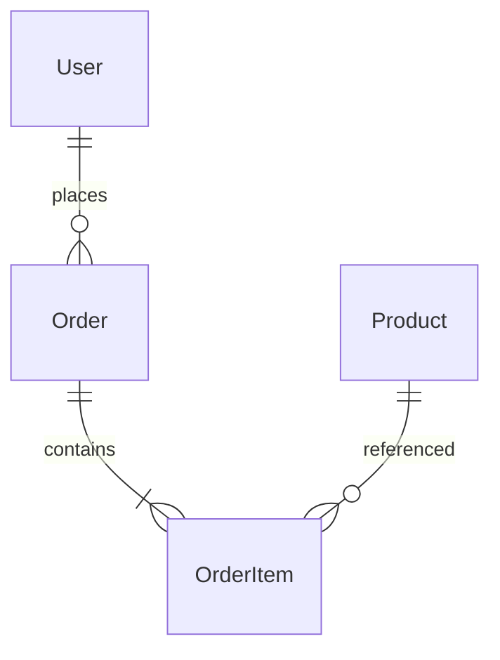

## Анализ и проектирование

### Цель

Анализ и проектирование — это фундамент стадий разработки, на которых формируется **понимание задачи**, **модель решения** и **архитектура системы**.
Без чёткого анализа проект превращается в случайный набор решений, а без проектирования — в технический долг, который растёт экспоненциально.

---

## Этапы анализа

### 1. Постановка задачи

* Определить, **какую проблему решает система**, а не просто «что нужно сделать».
* Сформулировать **цель** в терминах пользователя и бизнеса.
* Зафиксировать ограничения: время, бюджет, производительность, безопасность.

**Пример:**

> Цель: уменьшить время оформления заказа на 30%.
> Ограничения: не менять API, использовать существующий стор.

---

### 2. Сбор требований

* **Функциональные:** что система должна делать.
* **Нефункциональные:** производительность, отказоустойчивость, безопасность.
* **Бизнес-требования:** измеримые цели.
* **Пользовательские сценарии:** кто, что и зачем делает.

Инструменты:

* интервью с заказчиком;
* анализ текущего процесса;
* прототипирование и user stories.

---

### 3. Формализация и спецификация

Результат анализа — **документ требований (SRS)**, в котором описаны:

* сценарии;
* входы и выходы;
* приоритеты;
* зависимости и риски.

Пример user story:

> Как пользователь, я хочу видеть сохранённые адреса доставки, чтобы быстро оформлять заказ.

---

## Этап проектирования

Проектирование отвечает на вопрос: **как именно реализовать решение**, чтобы оно было надёжным, расширяемым и поддерживаемым.

---

### 1. Архитектурное проектирование

* Определение архитектурного стиля: монолит, микросервисы, event-driven, CQRS, SPA/SSR.
* Определение модулей, слоёв и границ ответственности.
* Диаграммы взаимодействий, компонентов и потоков данных.

**Инструменты:**
UML, C4 Model, PlantUML, Structurizr, draw.io.

**Пример (C4 Model уровни):**

* **Контекст:** кто использует систему (пользователи, внешние сервисы).
* **Контейнеры:** веб-приложение, API, БД, очередь.
* **Компоненты:** логические модули приложения.
* **Код:** конкретные реализации и классы.

---

### 2. Логическое проектирование

Создание моделей данных, API и бизнес-правил.

**Пример: модель заказа**



**API:**

```
GET /api/orders/:id
POST /api/orders
```

**Результат:**

* структура данных (ER-диаграмма, JSON-schema);
* протоколы взаимодействия (REST/gRPC/GraphQL);
* формат обмена;
* валидация и правила обработки ошибок.

---

### 3. Физическое проектирование

* Реализация БД: индексы, типы данных, нормализация.
* Планирование инфраструктуры: деплой, контейнеризация, CI/CD.
* Распределение сервисов по окружениям.

---

## Диаграммы проектирования

| Тип диаграммы          | Что показывает                         | Пример                         |
| ---------------------- | -------------------------------------- | ------------------------------ |
| **Use Case**           | Поведение системы глазами пользователя | “Пользователь оформляет заказ” |
| **Class / Entity**     | Структуру данных и взаимосвязи         | Пользователь → Заказ → Товар   |
| **Sequence**           | Последовательность вызовов             | Front → API → Service → DB     |
| **Component / Module** | Модули и их интерфейсы                 | AuthService, CatalogService    |
| **Deployment**         | Развёртывание и инфраструктуру         | API, Redis, PostgreSQL, CDN    |

---

## Анализ бизнес-процессов

### BPMN (Business Process Model and Notation)

Используется для описания **потока действий** между участниками процесса.

Пример процесса оформления заказа:

```
Пользователь → [Заполнить корзину] → [Оплатить] → [Получить подтверждение]
                     ↓                         ↓
               [Система проверяет оплату] → [Формирует заказ]
```

Результат — прозрачная модель, где видно узкие места и дублирование операций.

---

## Принципы проектирования

1. **KISS (Keep It Simple, Stupid)** — простота важнее изощрённости.
2. **DRY (Don’t Repeat Yourself)** — не дублируй бизнес-логику.
3. **SOLID** — принципы проектирования классов и компонентов.
4. **YAGNI (You Ain’t Gonna Need It)** — не реализуй то, что «вдруг пригодится».
5. **Separation of Concerns** — разделение ответственности по слоям.
6. **Encapsulation** — скрывай детали реализации.
7. **Scalability by Design** — система должна масштабироваться без рефакторинга.

---

## Анализ рисков

Перед реализацией нужно оценить возможные риски:

* **Технические:** неопределённые API, слабая документация.
* **Производственные:** недооценка сроков.
* **Безопасностные:** отсутствие авторизации или валидации.
* **Инфраструктурные:** отказ БД, утечки данных.

Для каждого риска — оценка вероятности и плана смягчения (mitigation plan).

---

## Артефакты проектирования

* **Техническое задание (ТЗ)** — формализует требования.
* **Архитектурная схема** — визуализирует модули и их связи.
* **API спецификация** — OpenAPI / Swagger / Proto / SDL.
* **ER-диаграмма** — структура данных.
* **Документ ADR** — фиксация архитектурных решений.
* **Runbook** — инструкции по деплою и эксплуатации.

---

## Инструменты анализа и проектирования

* **PlantUML / Mermaid / Draw.io / Excalidraw** — визуализация диаграмм.
* **Notion / Confluence / Miro** — документация и схемы процессов.
* **Swagger / Stoplight / GraphQL SDL** — проектирование API.
* **dbdiagram.io / DBeaver** — моделирование баз данных.
* **Structurizr / C4-PlantUML** — архитектурное моделирование.

---

## Связь с разработкой

1. Анализ → определяет **что делаем**.
2. Проектирование → решает **как делаем**.
3. Реализация → **делает так, как спроектировано**.
4. Тестирование → **проверяет, что работает как задумано**.

---

## Чек-лист анализа и проектирования

✅ Цели и требования зафиксированы.
✅ Пользовательские сценарии описаны и согласованы.
✅ Архитектура выбрана и визуализирована.
✅ Модели данных и API определены.
✅ Оценены риски и зависимости.
✅ Подготовлены ADR и схемы.
✅ Все артефакты доступны команде.
✅ Проектирование соответствует ограничениям.

---

Анализ и проектирование — это не формальность, а **инвестиция в скорость и устойчивость проекта**.
Чем яснее структура и границы на старте, тем меньше хаоса и ошибок на этапе реализации.
